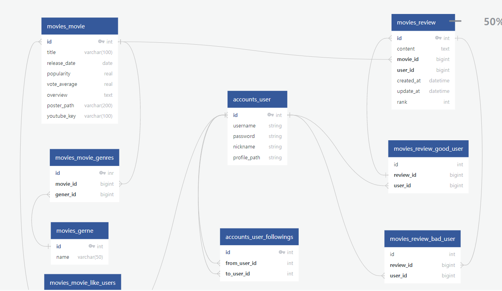

# 3일차

# 류원창

개발목록: 유저 기능 관련
날짜: 2022년 11월 18일

할 일

- [x] 회원가입, 로그인, 정보수정 페이지 유효성검사, 라우팅 가드 설정
- [ ] 네브바 만들기

# 회원가입 페이지 유저네임, 패스워드 유효성 검사

- 회원가입 페이지에서, 유저네임과 패스워드에 대해 유효성 검사를 하고 적절하게 밑에
- 비밀번호가 너무 짧습니다 등을 띄우고 싶다.
- 하지만, 좀 해보니 어려운 작업이다.
- 일단, username에 대해 이미 있는 이름이면 사용할 수 없다고 밑에 메세지를 띄우자

### 유저네임 유효성 검사

- 유저네임의 유효성 검사를 하는 것은 크게 두 가지다
- 하나는 너무 짧은 이름, 또 하나는 이미 있는 경우
- 이번 프로젝트는 이미 있는 경우만 체크하도록 하자.
- 그걸 위해 accountsStore의 state에 usernames라는 빈 배열을 하나 만들고 회원가입 할 때 마다
- username을 push해주자
- 그러고 usernames를 회원가입 페이지의 computed속성에 가지고 와서 비교를 한다.

![Untitled]3일차_류원창.png)


이런 식으로 작업한다.

### 유저네임 유효성 검사 완료


### 비밀번호 유효성 검사 완료

- 사실은 좀 더 이쁘게 꾸미고 싶었으나, 지금의 css실력으론 무리라고 판단
- 단순 비밀번호의 글자 수와 일치하는지 여부를 보여줌


# 로그인 여부에 따른 라우터 가드 설정

- 로그인 한 유저라면 회원가입과 로그인 페이지로 못가게 해야하고
- 로그인 하지 않은 유저라면 정보수정 페이지와 프로필 페이지에 가지 못하게 해야한다.

### 전역 가드

- 로그인 하지 않은 사용자가 특정 페이지에 가지 못하게한다.

router/index.js


### 라우터 가드

- 이제 로그인한 사용자는 회원가입과 로그인 페이지에 접근하지 못하게 해야하는데,
- 라우터의 index.js에서 로그인을 한 여부를 어떻게 확인해야할지 잘 모르겠다.
- 로컬 스토리지에는 vuex로 앱마다 나누어져서 제이슨으로 저장되어서 이걸 객체로 풀고 하면 될 것같긴 한데,
- 그냥 로그인페이지와 회원가입페이지의 creaetd에 로그인 했으면 ‘/’으로 이동 하도록 했다.


## 문제 라우터의 index.js에서 로그인 여부 확인

- 개별 vue파일에서는 vuex의 index.js에서 로그인 여부를 확인 할 수 있으나,
- 라우터의 index.js에선 로컬스토리지에 저장된 값을 가져와야한다.
- 하지만 로컬스토리지에는 json형태를 가진 객체가 저장되어 있다.
- 이를 잘 접근하면 되겠다.

## 라우터 문제 해결


- 위의 방식대로 조회를 하면 개별 token의 값을 가져올 수 있다.

# 네브바 만들기

- 이제 유저 관련에서 벗어나 메인인 영화에 관련한 페이지를 구축해야한다.
- 일단, 네브바를 만들어 보자

### 초안 1


- 아직 누르면 이동하는 기능은 없다
- 껍데기 코드이다

### 초안 2


- 오른쪽에 유저 프로필 이미지를 놓고, 누르면 드롭다운 형태로 링크들이 뜨는 것을 만들었다.
- 이제 초안 2의 프로필 이미지 코드를 초안 1의 맨 오른쪽에 붙이면 되겠다.
- 맨 오른쪽에는 로그인을 안한 경우는 로그인을 할 수 있는 버튼을 보여주고
- 로그인을 했다면 프로필 이미지를 보여주면 되겠다.

## 네브바 대충 완성


- 유저가 로그인 하지 않았다면 로그인과 회원가입 버튼을 보여주고
- 로그인 했다면 유저의 프로필을 보여준다.
- 유저의 이미지를 클릭하면 드랍다운이 나오며 클릭시 해당 링크로 이동한다.

&nbsp;
...  
...  

# 이지은

개발목록: django
날짜: 2022년 11월 18일

- [x] django - vue 연동하여 movie detail  정보 불러오기
- [x] django review 모델 정의 ⇒
- [ ] 11.19 에 good_user / bad_user 다시 정의
- [x] review CRUD
- [ ] django - vue 연동하여 movie detail  페이지에서 리뷰 CRUD → 조회만 완성
- [x] README_ 3일차 소감 📕

## DB → Vue / movie detail  정보 불러오기

### …mapActions 인자 넘기기 문제 해결

movie detail 페이지로 이동 시 `mapActions에 ‘movieId’` 인자 함께 넘겨주기

```jsx
const moviesStore = 'moviesStore'

export default {
  name: 'MovieDetailInfoView',
  computed: {
    ...mapGetters(moviesStore, ['movie']),
  },
  methods: {
    ...mapActions(moviesStore, ['getMovieDetail']),
  },
  created() {
    const movieId = this.$route.params.id
    this.getMovieDetail(movieId)
  }
}
```

params로 넘겨 받은 인자를 store/modules/moviesStore의 actions 인자로 넘겨 주기.

 변수로 선언 후에   `this.getMovieDetail(movieId)` 처리

## Review 모델 정의

**back-end/movies/models.py**

```python
class Review(models.Model):
    movie = models.ForeignKey(Movie, on_delete=models.CASCADE)
    user = models.ForeignKey(settings.AUTH_USER_MODEL, on_delete=models.CASCADE, related_name='reviews')
    rank = models.IntegerField(validators=[MinValueValidator(0), MaxValueValidator(5)])
    good_user = models.ForeignKey(settings.AUTH_USER_MODEL, on_delete=models.CASCADE, null=True, related_name='good_reviews')
    bad_user = models.ForeignKey(settings.AUTH_USER_MODEL, on_delete=models.CASCADE, null=True, related_name='bad_reviews')
    content = models.TextField()
    created_at = models.DateTimeField(auto_now_add=True)
    updated_at = models.DateTimeField(auto_now=True)
```



movie - review ⇒

- review-movie ⇒ 1:N
- reivew-user ⇒ 1:N
- review-good_user ⇒ 1:N
- review-bad_user ⇒ 1:N

rank ⇒ 영화 평점

good_user ⇒ 리뷰 좋아요를 누른 사용자

bad_user ⇒ 리뷰 싫어요를 누른 사용자 

—>유저가 N / review 가 1 dls 1:N 관계 =⇒ User Model 에서 FK 다시 정의 

## Review(CRUD)

**back-end/movies/views.py**

```python
# movie_Detail -> 전체 리뷰 조회(GET) 리뷰 생성(POST)
@api_view(['GET', 'POST'])
@permission_classes([IsAuthenticatedOrReadOnly])
def review_list_create(request, movie_pk):
  if request.method == 'GET':
    reviews = Review.objects.filter(movie_id=movie_pk)
    # 외래키의 movie_id가 movie_pk와 일치하는 경우 .filter(movie_id=movie_pk)
    serializer = ReviewListSerializer(reviews, many=True)
    # 복수 객체
    return Response(serializer.data)
  else:
  # 생성(POST)
    movie = get_object_or_404(Movie, pk=movie_pk)
    serializer = ReviewSerializer(data=request.data)
    if serializer.is_valid(raise_exception=True):
        serializer.save(user=request.user, movie = movie)
        # user, movie 외래키 참조 객체 설정
        return Response(serializer.data, status=status.HTTP_201_CREATED)

@api_view(['GET', 'DELETE', 'PUT'])
@permission_classes([IsAuthenticatedOrReadOnly])
def review_detail(request, review_pk):
# movie_Detail -> 리뷰 조회(GET), 수정(PUT), 삭제(DELETE)
    review = get_object_or_404(Review, pk=review_pk)
    if request.method == 'GET':
        serializer = ReviewSerializer(review)
        return Response(serializer.data)
    else:
        if request.user == review.user:
            # 작성자와 같은 경우
            if request.method == 'DELETE':
                review.delete()
                data = {
                    f'{review_pk}번 리뷰가 삭제되었습니다.'
                }
                return Response(data, status=status.HTTP_204_NO_CONTENT)
            if request.method == 'PUT':
                serializer = ReviewSerializer(review, data=request.data)
                if serializer.is_valid(raise_exception=True):
                    serializer.save()
                    return Response(serializer.data)
        else:
            return Response(status=status.HTTP_403_FORBIDDEN)
            # 작성자와 다른 경우
```

## postman 을 이용하여 DB에 review 작성하기

### ****Error Response****

**HTTP Status Code**

`401 Unauthorized`

-로그인 되지 않은 사용자에게 요청이 들어올 경우 / 로그인 정보가 잘못된 경우

```
{
"detail": "자격 인증데이터(authentication credentials)가 제공되지 않았습니다."
}
```

### ERR 해결 방안

### **Permission**

`IsAuthenticatedOrReadOnly`

인증된 user만 요청에 성공 할 수 있으며,  인증되지 않은 user는 읽기(method `GET`)만 가능합니다.

**Token인증 방법**

아래와 같이 헤더에 Token값을 입력하여 요청을 보냅니다.


**⇒ 정상 응답 확인**

→ 이 때 good_user 과 bad_user의 FK 에 null=True 를 해 줄 경우 빈 값 사용 가능

## 

## 📕3일차 소감

 3일차가 되어서야 프로젝트 진행에 탄력을 받은 느낌이다. 

1, 2 일차에는 프로젝트 진행 속도가 느렸고 README 정리도 생각한 만큼 잘 하지 못했다.

집에서 프로젝트한 것이 강의실에서 보다 업무 효율이 더 높았고, 이번 온라인 수업을 통해 재택근무가 내게 더 맞지 않을까 하는 생각이 들었다.

페어프로그래밍 진행도 강의실에서보다 원활히 진행되었다. 

페어인 원창님과 디스코드 화면 공유를 통해 프로젝트에 대해 이야기를 나누고 서로의 코드를 리뷰, 합병하는 것이 앞선 이틀의 페어프로그래밍 보다 더 잘되었다. 

**-배운 것**

Review-Movie-User 모델의 관계를 정리하며 1:N  or N:M 관계의 모델들이 서로 어떤 식으로 데이터를 참조하는지 정리가 되었다.