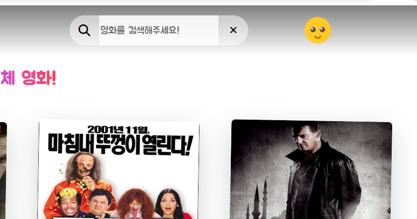

# 9일차

# 류원창

# 검색한 내용 보여주는 페이지 완료

- 검색할 키워드 입력 후 엔터키를 누르면 밑의 페이지로 이동

# 유저 회원가입 후 위시리스트에 담을 영화 페이지

- 유저가 회원가입을 하면 자신의 취향 영화를 위시리스트에 담을 페이지로 보내야한다.
- 이 페이지가 마지막으로 만들 페이지 일 것 같다.
- 어떤 방식으로 디자인을 짤지 생각을 하다가, 과거 유행했던 소개팅 어플인 스와이퍼가 생각났다.
- 이성의 프로필이 하나씩 나타나며 마음에 들면 오른쪽으로 스와이프하고 맘에 들지 않으면 왼쪽으로 스와이프
- 영화의 카드를 만들어 하나씩 보여주며 내 위시리스트에 add하거나 pass하는 페이지를 만들자.

### 레이아웃

- 이 페이지는 영화의 카드를 하나씩 보여줘야하는데, 전에 만들어놓은 디자인이 있어서 그걸 활용했다.
- 이제 저 포스터위에 마우스를 올리면 다음과 같이 보여진다.

- 이런 디자인의 카드가 많은 영화의 카드를 보여줄때는 사용할 수가 없었는데 이런 경우라면 가능하다.
- 여기서 pass를 누르면 다른 영화를 보여주고 add를 누르면 내 위시리스트에 담김과 동시에 다른 영화가 보여진다.

- 장고 서버에서도 확실히 요청을 받는다.

# home의 현재 유저 위시리스트 관련

- home의 코드를 보니 현재 유저의 위시리스트를 불러오는 함수가 좀 잘못되있었다.
- 수정했다.

- moviesStore의 함수가 user의 id를 userId로 접근을해버려서 userId와 authHead를 추가해주고 요청을 보낸다

- 정상 작동된다.

# 현재 유저 위시리스트에 있는 배우들 연관된 영화 가져오기

- 영화 추천 알고리즘을 위해 가볍게 현재 유저의 위시리스트에 담긴 영화들 중에 각 영화마다 출연한 배우의 출연작을 추천한다.
- 이를 위해 함수를 짤 필요가 있다.

## 완료

- for문돌리는 거라 그렇게 어렵진 않았다. 근데 거의 4중 for문인데 실행시간이 괜찮을까
- 일단 완료는 된다.

# 영화 알고리즘 추천을 위한 클릭 횟수 관련

- 유저들이 클릭을 많이한 영화를 추천해주고 싶다.
- 장고의 모델부터 다시 정의하고 클릭하면 +1 해주는 api만 만들면 될 것 같다.

- 성공 영화 디테일 페이지로 들어가면 user_click필드가 1증가 된다.
- 이걸 이제 home에서 사용 가능하도록 적절하게 computed로 가져온다.

# erd

- 링크: [https://app.quickdatabasediagrams.com/#/d/7lRpZ6](https://app.quickdatabasediagrams.com/#/d/7lRpZ6)

# 전체적인 백그라운드 이미지 마무리

- 생각보다 힘들었다.