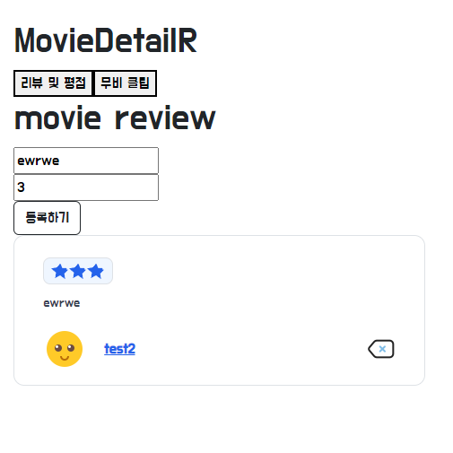

# 6일차

# 류원창

할일

- [ ]  디테일 페이지 완성하기

# 디테일 페이지 리뷰 작성

- 리뷰 작성은 이미 뼈대는 만들어져 있기 때문에 스타일을 다듬는다.



- 점수를 3점을 주면 별이 3개가 들어가고, 리뷰를 작성한 유저의 정보가 담아진다.
- 오른쪽 밑의 삭제버튼 역시 리뷰 작성자만 볼 수 있다.
- 이제 삭제 후 삭제된 게시물이 안보이게 수정해야한다.

### 모달 관련 문제

- 현재 디테일페이지는 다수의 컴포넌트들이 모여있고, 기본적으로 백그라운드이미지와
- 백그라운드를 가리는 검은색 투명도가 있는 div가 z-index로 설정되어있다.
- 이때 삭제를 누르면 모달창이 나오며 정말 삭제하시겠습니까? 라는 멘트가 모달로 떠야되는데,
- z-index문제인지 모달div에 접근할 수 없다.


- 이와 같이 모달버튼을 클릭하면 나오는 백그라운드의 검은색 불투명이 제일 앞으로 인식된다.
- 다른 페이지에서는 정상작동을 하는데, 향후 이 디테일 페이지에 모달로 프리뷰를 띄울 예정이니까
- 이 문제를 해결해야한다.

### 해결


- z-index의 속성에 대해 좀 알아봤는데, 만약 자식의 z-index가 9999라도 그 부모의 z-index가 1이면
- 그 자식은 z-index를 1로 갖게 된다.
- 쓸데없이 복잡한 것 같다. 그냥 절대값으로 하면 안되나?

### 삭제 시 모달 완료


- 네! 클릭시 버튼 삭제 메서드 호출
- 디자인에만 시간을 너무 많이씀
- 이제 삭제 후 리뷰 바로 리뷰 안보이게 조치해야겠다.

### 삭제 후 바로 리뷰 안보이게 하는거 해결

- vuex의 DELETE_REVIEW함수를 통해 삭제한 리뷰의 id를 filter를 통해 걸러넌다


### 리뷰 생성 후 인풋 값 초기화

- v-on 이벤트를 두개를 실행시켜야 한다.
- 하나는 input들 null로 만들기, 다른 하나는 create하는 함수
- v-on에 여러개의 이벤트를 달 때에는

```jsx
@click="[a(), b()]"
```

- 이런식으로 대괄호 안에 넣어주고 함수는 무조건 ()소괄호를 열어줘야한다.

### 리뷰 좋아요 문제와 해결

- 리뷰의 하트를 누르면 하트가 채워지며 좋아요 상태가 된다.
- 그런식으로 토글된다
- 근데 계속 바뀌지가 않아서 원인을 찾아보다 1시간이 걸렸는데 이유는 두 이미지의 주소가 같았다.
- 어쨋든 해결


# 리뷰 작성 폼 만들기

- 사실 기능은 다 구현이 되어있는데 디자인 하기가 시간이 너무 오래걸린다.
- 지금 까지 한 폼은 다음과 같다


- 상단의 한줄에는 유저의 프로필이미지와 닉네임 혹은 유저네임이 뜨고 아래 리뷰를 작성하도록 한다.
- 상단의 오른쪽 위에 별점을 줄 수 있는 애니메이션을 넣고, 제출 버튼을 조금 수정하면 될 것 같다.


- 리뷰 만들기는 완료 했다.
- 근데, 다른 무비 페이지로가면 test1이 적은 리뷰가 test2가 적었다고 하는 치명적인 에러를 발견
- 웬지 참조 문제인 것 같은데.. 여러가지 시도를 해봐야겠다.


- 이런 식으로 하고 nowUser를 사용하면 되겠다.

# 영화 포스터 가져오기

- tmdb에서 영화 포스터를 제공하는 api가 있다.
- 이걸 사용하면 되겠다.
- 영화 디테일 페이지에 가면 요청을 보낸다.


- data에 moviePosters를 만들어 영화 포스터 정보를 10개정도만 가져온다.


- 영화의 포스터 정보를 받아서 PosterSlider라는 컴포넌트에 내려준다.
- 이미지를 캐러셀 방식으로 만들고 싶어서 찾아보니
- `vue-slick-carousel` 라는 라이브러리를 사용할 수 있있다.
- 시간관계상 문서를 읽어보며 코드를 치진 않았고, 구글에 있는 소스코드를 가져와서 다듬었다.
- vue에서 유용하게 사용할 라이브러리같다. vue를 계속 사용할 거면 문서를 정독해서 사용법을 익히는게 좋을 것 같다.
- 소스코드를 가져와 사용하다보니 버튼의 위치나 이미지들의 위치, 높이, 너비 등을 다듬어야해서 오히려 시간이 많이 소요되었다.
- 이제 프리뷰 영상을 오른쪽에 적절히 배치하고 모달로 띄우면 될 것 같다.

&nbsp;

# 이지은

개발목록: 영화 홈 페이지

- [ ]  영화 홈페이지 제작

### 영화 메인 페이지

**장르&감독&배우와 관련된 영화 목록 보여주기**

**src/views/movies/MovieView.vue**

```jsx
<!-- 장르 (코미디 + 드라마) -->

        <div class="d-flex">
          <section>
            <p class="">배꼽 빠지게 웃긴 코미디</p>
            <div v-for="(movie, index) in mg1" :key='index'>
              <div class="card-item effect11 left_to_right">
                <a href="#">
                  <div class="img w-100">
                    
                  </div>
                <div class="info">
                  <h3>{{ movie.title }}</h3>
                  <p>출연: {{  }}</p>
                  <p>감독: {{  }}</p>
                </div>
                </a>
              </div>
            </div>
          </section>
        </div>

 <!-- 감독 (봉준호) -->
         <div>
          <section>
            <p class="">'기생충'의 봉준호 감독</p>
            <div v-for="(movie, index) in mg1" :key='index'>
              <div>{{ movie.title }}</div>
            </div>
          </section>
        </div>

<!-- 배우 (톰쿠르즈) -->
        <div>
          <section>
            <p class="">노장은 살아있다! '탑건'의 콤크루즈</p>
            <div v-for="(movie, index) in rmM35" :key='index'>
              <div>{{ movie.title }}</div>
            </div>
          </section>
        </div>
```

사용자가 본인이 선호하는 (장르|배우|감독)의 영화를 고를 수 있도록 영화 카테고리를 묶어두었다.

**src/store/moviesStore**

<장르 별로 묶은 영화 배열 만들기>

```jsx
// 장르 (코미디 + 드라마)
    g1: (state) => state.movies.filter((movie) =>  movie.genres.includes(35) && movie.genres.includes(28)&& movie.genres.includes(35)),
    // 장르 (공포)
    g2: (state) => state.movies.filter((movie) => movie.genres.includes(27)),
    // 장르 ( 범죄 + 스릴러 )
    g3: (state) => state.movies.filter((movie) => movie.genres.includes(53) &&  movie.genres.includes(80)),
    // 장르 ( 애니메이션 + 가족 )
    g4: (state) => state.movies.filter((movie) => movie.genres.includes(16) &&  movie.genres.includes(10751)),
    // 장르 (판타지 + SF)
    g5: (state) => state.movies.filter((movie) => movie.genres.includes(14) &&  movie.genres.includes(878)),
```

**src/views/movies/MovieView.vue**

```jsx
// 홈페이지에 보여 줄 영화 카테고리 불러오기 

-create-
this.getSectionMovies()

-methods-
getSectionMovies() {
      const m1 = _.sampleSize(this.g1, 12)
      this.mg1 = m1
      const m2 = _.sampleSize(this.g2, 12)
      this.mg2 = m2
      const m3 = _.sampleSize(this.g3, 12)
      this.mg3 = m3
      const m4 = _.sampleSize(this.g4, 12)
      this.mg4 = m4
      const m5 = _.sampleSize(this.g5, 12)
      this.mg5 = m5
 },
```

→ mapGetters를 통해 갖고온 영화 배열에서, 영화 12 개씩을 랜덤으로 선별하여 MovieView에 나타내기

## 현재 상영중인 영화 유튜브 트레일러 영상 재생

**src/views/movies/MovieView.vue**

```html
<div>
        <h1>video</h1>
        <div id='area'>
        <iframe id='video' :src=videoURL
         frameborder="0" allow="autoplay">
         </iframe>
        </div>
      </div>
```

```jsx

-computed-
videoURL() {
      return `https://www.youtube.com/embed/${this.playMovie}?autoplay=1&mute=1`
    },

-methods-
**//페이지 상단에 재생 되는 영화 유튜브ID 요청
    ...mapActions(moviesStore, ['playMovie']),

    // 페이지 상단에 재생 되는 영화 유튜브ID 요청
    pickPlayMovie() {
      const play = _.sample(this.nowmovies)
      this.playMovie = play.youtube_key
    },

-create-
// 페이지 상단에 재생 되는 영화 유튜브ID 요청
    this.pickPlayMovie()**
```

iframe테그를 이용해 유튜브 영상 자동 재생

## MovieView 레이아웃


⇒ 스크롤바 디자인 수정 + 비디오 재생 섹션 디자인 필요
