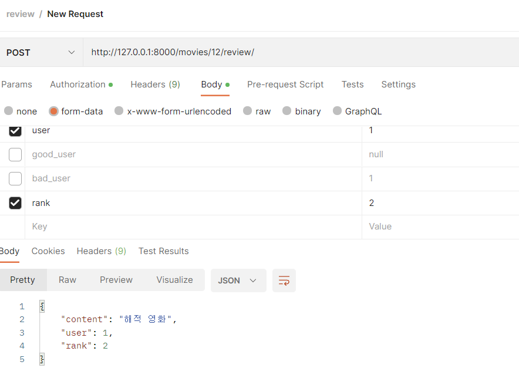

# 5일차

# 류원창

날짜: 2022년 11월 20일

할일

- [ ]  온보딩 페이지 만들기
- [x]  지금까지 만든 페이지 다듬기
- [x]  영화 장르별로 vuex의 getters에 넣기
- [x]  랜덤 추천 페이지 만들기
- [x]  없는 페이지 라우팅 가드 만들기
- [ ]  카드 다듬기

# 영화 디테일 홈페이지의 장르 관련

- movie가 가지고 있는 장르는 장르의 이름이 아니라 장르의 id이다
- 이를 이름으로 변환시켜야 된다.

### 장르 아이디와 장르명 추가

- vuex에 장르 아이디와 장르명을 추가한다.


- 근데 위와 같이 계속 하나의 배열에 여러개의 장르의 객체가 들어있는 형태로 저장이 된다
- 왜그런지 도저히 모르겠다.
- 여튼 반복문을 통해 일치하는 장르명을 추가한다.


### 문제 상황

- 일단 장르명을 잘 가져와지긴 하는데, 다른 페이지로 가면 똑같은 장르명이 나오고, 다시 새로고침해야 제대로 장르를 또 가져온다.


- 위 사진은 처음 잘 가져온 장르


- 다른 디테일 페이지로 가면 같은 장르명이 나오고 새로고침해야 제대로 장르명이 바뀐다.
- 아무래도 라이프사이클에서 뭔가 처리를 해줘야 될 것 같다. 아니면 computed로 넣으면 될려나 싶다.

### 또 문제


- 잠깐 외출하고 오니까 다시 제대로 객체로 가져온다.
- 반복문 돌린 코드가 의미 없어진다
- 하.. 그리고 아직 라이프사이클 문제가 있다.

### 문제 해결

- 처음에 디테일 페이지에 가면 getmovieinfo라는 함수를 실행시켜 path에 맞는 movie정보를 가져오는데,
- 이때 movie객체에 추가로 thisMovieGenre라는 배열을 추가시켜, 장르id에 맞는 장르명을 넣어준다.


# 장르별 영화 뽑아내기

- 나중의 작업을 위해 장르별로 영화를 뽑아내면 편할 것 같다.
- vuex의 getters에 넣으면 적절할 것 같다.


# 랜덤 추천 페이지 만들기

- 간단하게 랜덤으로 추천하는 페이지를 만들기로 한다.
- 파이널 프로젝트 바로 전에 했던 페이지를 가져다 쓰면 될 것 같다.

### 영화 카드 관련 문제

- 영화 카드라는 컴포넌트를 사용하는데, 이 컴포넌트는 누르면 라우터링크로 이동할 수 있도록
- 라우터 링크가 걸려있다.
- 이상하게 라우터 링크로 감사놓으면 넓이가 커진다. 인라인 스타일에 넓이를 적용해도 말을 듣지 않는다.

### 해결

- a태그는 좀 희한한 속성을 갖고 있는 것 같다.
- 그냥 클릭시 라우터 push을 통해 이동시키게 하고, 스타일에 포인터를 준다.


# 404낫파운드 페이지

- 없는 경로로 이동할 경우 404낫파운드 페이지로 이동시킨다.
- 라우터의 index.js와 페이지를 적절히 만든다.


- 없는 경로로 이동시 위의 페이지를 보여준다.

# 카드 다듬기

- 현재 우리는 카드를 단순히 이미지, 제목, 평점 정도로 놓고 있다.
- 카드를 일단 그냥 이미지만 보여주고 마우스롤 위에 올리면 정보가 오버레이되게 하고싶다.

### 예시


- 아직 해결 못함

# 리뷰 관련 문제

- 리뷰를 생성하고, 바로 삭제가 불가능함, 새로고침 하고 삭제 눌러야 삭제됨
- 또한, 삭제 후 리뷰가 남아있고, 새로고침하면 사라짐

### 리뷰 생성 후 바로 삭제 문제 해결

- 시리얼라이저가 반환하는 데이터값이 몇개가 빠져 있었다.
- 시리얼라이저의 필드와 리드온리 필드를 건드린다.


- 리뷰의 id와 작성시간역시 보내준다.
- 일단 생성 후 삭제는 해결되었으나, 추가적으로 좋아요한 사람의 수와 싫어요한 사람의 수 역시 넘겨줘야 되서
- 수정이 더 필요하다.
- 잘못 생각했다. 어차피 처음 만들면 좋아요, 싫어요 한 사람의 수는 0이니까 의미가 없다.
- 아니다, 그래도 일단 보여줘야되니까 넣어주자

### 시리얼라이저 수정


- 좋아요와 싫어요 수를 반환해준다.

&nbsp;

# 이지은

# 5일차

개발목록: 영화 디테일 페이지

- [x]  디테일 페이지 리뷰 CRD
- [x]  ReviewCreateSerializer 수정
- [x]  vue에서 리뷰 작성 시 DB에 저장
- [x]  vue에서 리뷰 삭제 시 DB에서 삭제 / 삭제 시 삭제 alert 띄우기

- 현재 **디테일 페이지 컴포넌트 구조**
    
    **MovieDetailInfo**
    
    **└MovieDetailR**
    
    **│  ├MovieReview**
    
    **│   │  ├CreateReview**
    
    **│   │  ├MovieReviewItem**
    
    **│  ├MovieClup**
    
    ## ReviewCreateSerializer 수정
    
    ```python
    class ReviewCreateSerializer(serializers.ModelSerializer):
        class Meta:
            model = Review
            # fields = ('content', 'user', 'movie', 'rank',)
            fields = ('content', 'user', 'rank',)
            # read_only_fields = ('user', 'movie',)
            # 작성 불요 (read_only_fields)
    ```
    
    **⇒ 리뷰 작성 시 movie 정보에 대한 fields 를 수정해 주었다.**
    
    
    
    
    
    ### ⇒ 생성(POST) 과 조회(GET) 요청이 잘 되는 것을 확인 할 수 있다.
    
    **movieId 에 대한 정보는 따로 넘겨주지 않더라도 store 에서 가져다 쓸 수 있도록 수정**
    
    ## CreateReview에서 moviesStore 로 mapActions 요청 시 인자 넘겨 주기 ⇒ 해결
    
    ```jsx
    <template>
      <div>
         <div>
          <input type="text" v-model.trim="content" placeholder="리뷰를 작성하세요">
        </div>
        <div>
          <input type="text" v-model.trim="rank" @keyup.enter="createReview" placeholder="1부터 5까지 평점을 입력하세요">
        </div>
        <button type="button"  
    		@click="createReview({ content: content, movieId: movieId, 
    		rank: rank, user: user.id, authHead: authHead  })">등록하기</button>
      
    </div>
    </template>
    
    <script>
    import {  mapActions, mapGetters } from 'vuex';
    const moviesStore = 'moviesStore'
    const accountsStore = 'accountsStore'
    
    export default {
        name: 'CreateReview',
        computed: {
          ...mapGetters(moviesStore, ['movieId']),
          ...mapGetters(accountsStore, ['authHead', 'user'])
        },
        data() {
          return {
            content: null,
            rank: null,
          }
        },
        methods: {
          ...mapActions(moviesStore, ["createReview"]),
        },
        created() {
          this.movieID = this.movieId
        }
    }
    </script>
    
    <style>
    
    </style>
    ```
    
    **⇒ …mapActions 에 payload 를 넘겨 줄 때는 mutation에 직접 적어서 넘겨줘야한다.**
    
    ## 리뷰 생성 ⇒ state의 reviews에 추가
    
    
    
    **store/modules/moviesStore ⇒ actions**
    
    ```jsx
    createReview( { commit }, reviewItem) {
          commit
          console.log('리뷰아이템', reviewItem)
          // if (reviewItem.content) {
          axios({
            method: "post",
            url: `${API_URL}/movies/${reviewItem.movieId}/review/`,
            data: {content: reviewItem.content, rank: reviewItem.rank, user: reviewItem.user},
            headers: reviewItem.authHead
          })
          .then((res) => {
            console.log(res)
            commit('CREATE_REVIEW', res.data)
          })
          .catch((err) => {
            console.log(err)
          })
        }
    ```
    
    리뷰 생성 후 mutations 에서 state reviews 변경을 하려고 한다.
    
     **store/modules/moviesStore ⇒ mutations**
    
    ```jsx
    
    CREATE_REVIEW: (state, review) => (state.reviews.add(review))
    
    -- 수정 후
    
    CREATE_REVIEW: (state, review) => (state.reviews.push(review))
    ```
    
    push 가 아니라 add 를 사용해서 난 오류 / 해결
    
    ## 리뷰 추가 시 , 데이터 누락 & 새로 고침을 해야 데이터가 들어가는 에러
    
    
    
    **리뷰 <등록하기> 클릭 후 createReview axios 요청을 하면**
    
    
    
    **작성 시간 / good_user / bad_user / [review.id](http://review.id) 에 대한 정보가 누락 됨**
    
    **이 상태에서 새로고침을 하면**
    
    
    
    **정보가 들어옴**
    
    **이와 같은 오류 들 때문에 deleteReview 도 작동이 안된다.**
    
    **리뷰 작성 후 새로고침을 해야 [review.id](http://review.id) 가 생성되고,**
    
     **back-end의 리뷰 삭제 url인 /movies/review/<int: review_pk> 에 axios 요청을 보낼 수 있다.**
    
    ## 리뷰 삭제
    
    **src/components/MovieReviewItem.vue**
    
    ```jsx
    <template>
      <div id='personal_review'>
          <div>평점: {{ review.rank }}</div>
          <div>작성시간 : {{ review.created_at }}</div>
          <div>사용자: {{ review.user }}</div>
          <div>{{ review.content }}</div>
          <div>좋아요한 사용자 : {{ review.good_user }} | 싫어요 한 사용자 : {{review.bad_user }}</div>
           <button type="button" class="btn btn-sm" @click="deleteReview({ reviewId : review.id, authHead : authHead, user:user.id, movieId: movieId })">x</button>
      </div>
    </template>
    
    <script>
    import {  mapActions, mapGetters } from 'vuex';
    const moviesStore = 'moviesStore'
    const accountsStore = 'accountsStore'
    
    export default {
        name: 'MovieReviewItem',
        props: {
            review: Object
        },
        computed: {
          reviewId() {
            return this.review.id
          },
          ...mapGetters(moviesStore, ['movieId']),
          ...mapGetters(accountsStore, ['authHead', 'user'])
        },
    
        methods:{
          ...mapActions(moviesStore, ["deleteReview"]),
        },
        
    }
    </script>
    
    <style>
    #personal_review {
      border: black 1px solid;
      border-radius: 10%;
    }
    </style>
    ```
    
     
    
     `...mapActions(moviesStore, ["deleteReview"]),`
    
    리뷰 삭제 요청
    
    **src/sotore/moviesStore**
    
    ```
    deleteReview( {commit }, reviewItem) {
          axios({
            method: "delete",
            url: `${API_URL}/movies/review/${reviewItem.reviewId}/`,
            headers: reviewItem.authHead
          })
          .then((res) => {
            console.log(res)
            commit
            alert("리뷰가 삭제되었습니다!")
            // commit('DELETE_REVIEW', res.data)
            this.$router.push({ name: "MovieDetailInfoView", params: { id: reviewItem.movieId } })
    
          .catch((err) => {
            console.log(err)
            alert("본인만 삭제가능합니다!")
          })
        })
      }
    ```
    

⇒ 정삭적으로 동작이 된다.