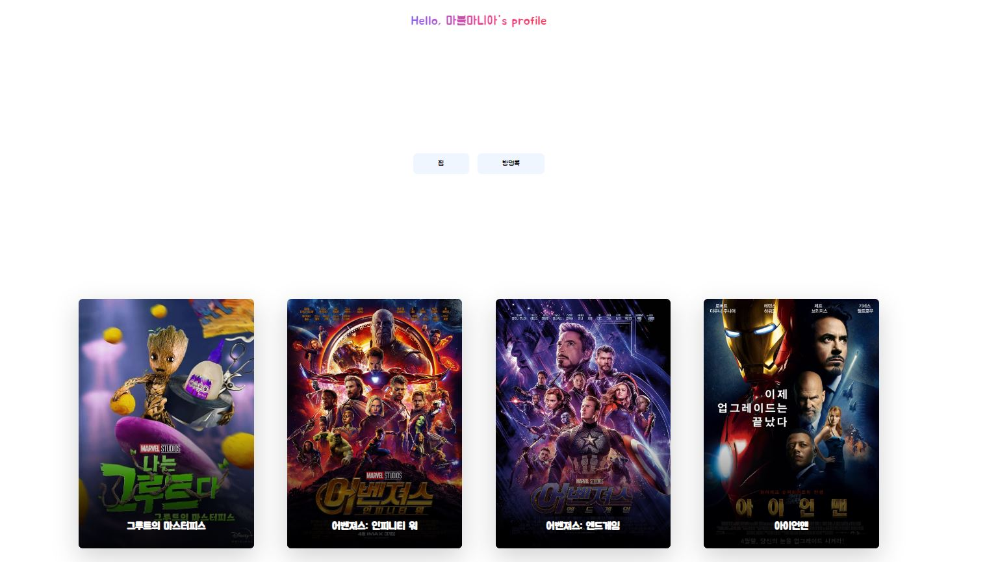

# 이:유

`이유있는 영화 추천 이:유`

[프로젝트 메모 및 공유 : Notion](https://rose-mushroom-2f9.notion.site/1791c848606e4b30a543c6bc34284f95)

# 1. 프로젝트 개요 및 팀원 업무 분담 내역

📂 개발 기간: 2022.11.16 ~ 2022.11.25 (총 9일)

🎮 개발 도구 
- Python
  - Python 3
  - Django 3.2.12
  - Django REST framework
- HTML, CSS, JavaScript
  - Bootstrap 5
  - Tailwind 3
- Vue 2
  - Vuex
  - Vue Router

😎 류원창
  - 전체적인 틀 구성
  - 유저 (FE, BE)
  - 영화 전체, 장르별, 디테일 페이지 구성
  - 감정, 랜덤 영화 추천페이지 구성

👩 이지은  
  - 백엔드(Django API Server. 영화 API를 활용한 Data Seeding, API 가이드) & 프론트엔드 담당(Bootstrap 5, Vue.js, UI   구현, 디자인)  

# 2. 구현 기능 및 알고리즘

# 3. 데이터 베이스 모델링 (ERD)

[ERD 보러가기](https://app.quickdatabasediagrams.com/#/d/7lRpZ6)

# 4. 페이지와 기능 설명
## 렌더링 페이지

- 첫 렌더링 페이지
- 서비스 소개 글과 영화 장르별 이미지를 섹션으로 나누어
- 스크롤 시 다음 섹션으로 이동하는 스크롤 이벤트

&nbsp;

## Home 페이지

- 배경으로 영호 티저 재생
- 실시간 인기 영화는 현재 서비스에서 유저들이 가장 많이 누른 영화로 갱신
- 그 외에 장르별 영화들이 카드 형태로 나열

- 네브바 마우스 오버 변화

&nbsp;

## 회원가입 페이지

&nbsp;

## 회원가입 후 영화 위시리스트 담는 페이지

- 랜덤의 영화를 위시리스트에 넣거나 pass할 수 있는 페이지
- Add버튼을 누르면 위시리스트에 담기고 Pass버튼을 누르면 다른 영화 정보가 렌더링
&nbsp;

## 회원 정보 수정 페이지

- 내 프로필 사진 선택해서 변경
- 닉네임, 비밀번호 변경 가능

&nbsp;

## Movie 페이지

- 왼쪽의 메뉴를 통해 장르별 영화를 보여주는 페이지로 이동 가능
- 페이지 접속 시 적절한 갯수의 영화 정보를 렌더링 시키고, 무한스크롤을 통한 영화 정보 카드 추가

&nbsp;

## 영화 디테일 페이지

- 영화의 디테일과 리뷰 작성, 무비 클립이 렌더링 (컴포넌트 변경)
- 여기서 다른 회원의 프로필 페이지로 이동 가능

&nbsp;

## 유저 프로필 페이지

- 해당 유저가 찜한 영화를 보여줌 
- 방명록 버튼을 누르면 컴포넌트 변화를 통한 방명록을 통한 유저간의 소통

&nbsp;

# 5. 소감

### 류원창

프로젝트를 진행하며, 역시 아직은 많이 부족하다는 것을 크게 느꼇다. Django라는 프레임워크도 간단한 사용법만 안다는 사실을 dj-rest-auth의 내부에서 사용하고 있는 코드를 보며 느꼈다. 아직은 미숙할 수 밖에 없겠지만, 이렇게 프로젝트를 하나 씩 해나가며 배우는 것이라고 생각해야겠다. Vue역시 마찬가지로 제공하는 기능을 온전히 사용하진 못한 것 같다. 컴포넌트의 재사용성이라는 강력한 기능을 제공하는데도 익숙치 않아 vue파일을 너무 많이 만든것 같다는 느낌도 든다. 영화 추천 알고리즘에 대해 이야기하자면, 너무 깊게는 들어가지 못했다. 추천 이라는 것이 깊게 들어가면 머신러닝 등의 고급 기술들이 나오지만, 이번 프로젝트는 간단히 감정 상태나 그 사람이 좋아하는 영화에 관련된 영화 등으로 구현하였다. 프로젝트를 진행하며 파이썬을 처음 배울 때와 같은 무서움을 느꼇다. 분명 계획한대로, 생각한대로 진행이 되어야 하는데, 몸과 머리가 제대로 따라오지 못했다. 아직 프로그래밍에 대해 미숙한 점도 있겠지만, 정말로 부족함을 크게 느끼고 앞으로 잘 할수 있을까 라는 생각이 조금 들기도 한다. 그래도 어쩌겠는가 나는 앞으로도 계속해서 발전할 것이다.
지금까지의 나는 무엇이든 혼자 잘 할수 있다. 라는 생각을 가지며 살았고, 웬만한 것은 혼자 해냈다. 하지만, 이번 지은님과 페어 프로젝트를 진행하며 내가 부족한 부분이나 보지 못했던 시야를 지은님이 많이 이야기를 해주고 아이디어를 내주셔서 큰 도움이 되었다. 나 역시 도움이 되었었으면 좋겠다. 
나는 어떤 목표를 이루고자 하면 내 방식대로 하는 성향이 심한 부분이 있는데 지은님께서 잘 맞춰주시고 따라와주셔서 감사하다. 한편으로는 명시적 또는 암무적인 나의 역할을 제대로 지키지 못한 것 같아 죄송한 마음이 크다. 이번 경험을 통해 협업의 중요성을 잘 느낀 것 같다. 팀원들의 의견을 존중하고 때로는 객관적인 시각에서 바라보는 의견이 중요하다는 것을 배웠고 앞으로의 프로젝트나 프로그래밍 관련된 업무를 할 때 이 경험을 토대로 행동하고 배워나갈 것이다. 충분한 시간이라고 생각했는데 구현하지 못한 기능도 몇 개 있어 아쉽다. 하지만 이번 프로젝트를 통해 얻은 것이 많으니 다음 부터 더 잘해야겟다. 

### 이지은

프로젝트를 하면서 가장 크게 느낀 점은 코드의 유지 보수를 위해 코드를 깔끔하게 짜는 것이 중요하다는 것이었다. 간결할 코드, 직관적인 변수 ,함수명, 잘 나눠진 디렉토리 구성이 그 예이다.
 디렉토리와 관련해서는 moduke을 사용해 서버로의 요청을 나눈 것이 코드 관리에 용이했다. client에서 server로 보내는 axios요청이 많았는데 , 이 요청들을 Sotre/index.js 에서만 사용했다면 코드가 길어져서 코드의 관리가 힘들었을 것이다. modules 을 사용하여 axios 요청을 나눈 것이 코드 관리에 많은 도움이 되었다.  
 프로젝트를 하면서 백엔드와 프론트엔드를 모두 작성하였는데 둘의 장단점이 명확하게 보였다. 프론트는 작성된 코드가 동작하며 결과물이 페이지에 바로바로 시각적으로 보인다는 장점이 있다. 단점으로는 사용자의 동선을 생각해서 코드를 짠다는게 쉽지많은 않았다. 어느 부분에서 server로의 요청이 들어갈지, 어떤 데이터를 넘겨주고 넘겨 받는지를 생각해서 코드를 작성해야된다. 백엔드는 결과물이 눈에 보이지는 않지만 클라이언트와의 요청이 잘 주고받아지며 동작하는 것을 보며 뿌뜻함을 많이 느꼈다.프로젝트가 끝난 후에는 django 모델에 대해 더 공부해 볼 예정이다.  
 그리고 베타테스트의 중요성을 느꼈다. 작업을 하며 코드가 잘 동작하는 것을 확인 했는데도, 갑자기 예기치 못한 오류나 반례를 발견하는 것이 많았다. 서버를 완전히 배포하기 전에 여러 사용자로 부터 임시 테스트를 통해 서버의 안정성을 확보하는 것이 중요하다고 생각했다.  
 이번 프로젝트는 페어 프로그래밍인 많큼 페어와의 합이 중요했다. 페어인 원창님은 프로젝트 내낸 우리팀의 길잡이 역할을 해주셨다. 
 코드를 작성하다가 막히는 부분이 생기면 해결책을 바로 모색하여 주신 덕 분에 프로젝트를 성공적으로 마칠 수 있었다. 빠르게 페이지를 완성해가는 원창님을 보며 동기부여를 많이 받았다. 이번 프로젝트는 페어와 함께 성장 할 수 있었던 좋은 기회였다. 
